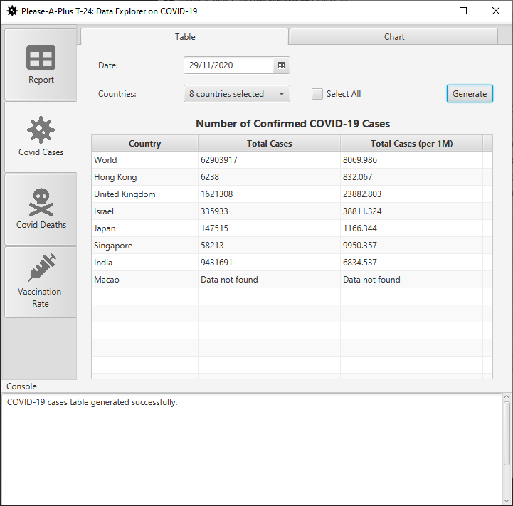
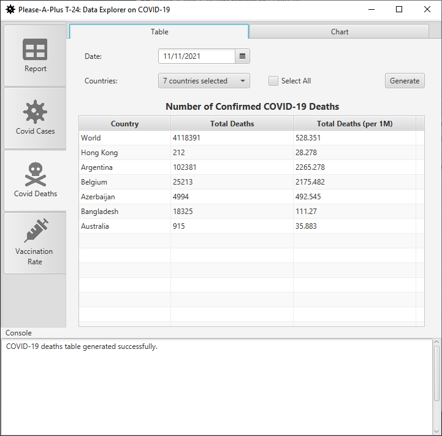
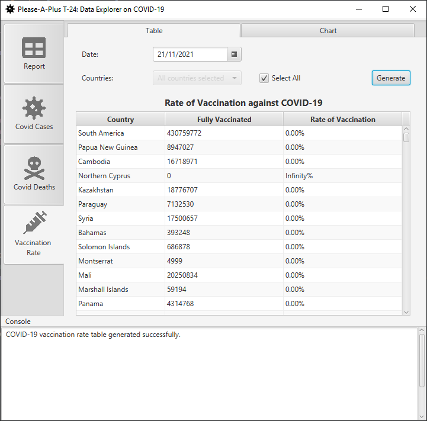
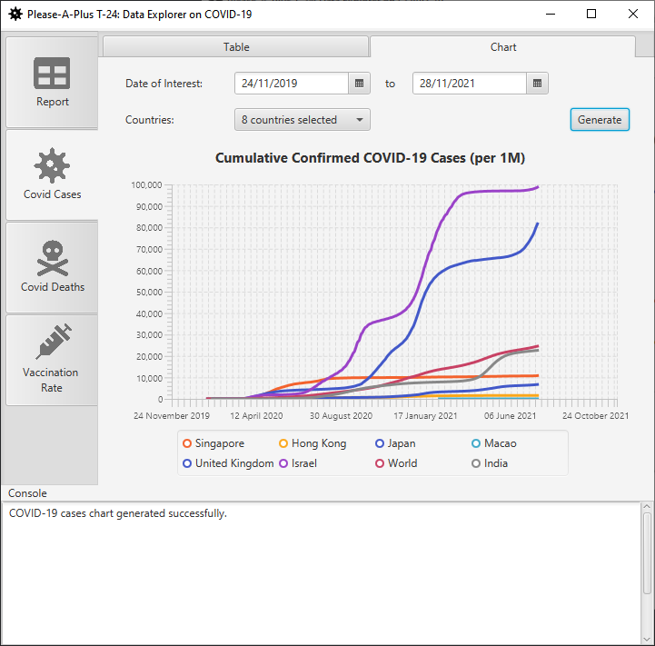
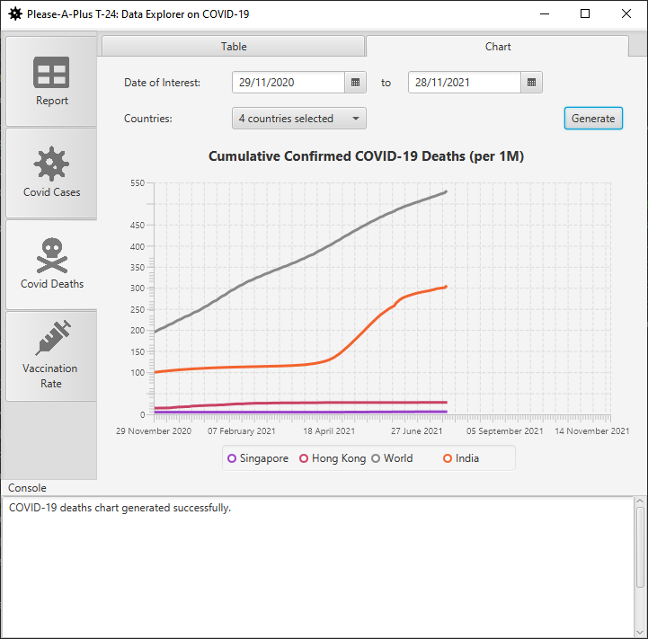
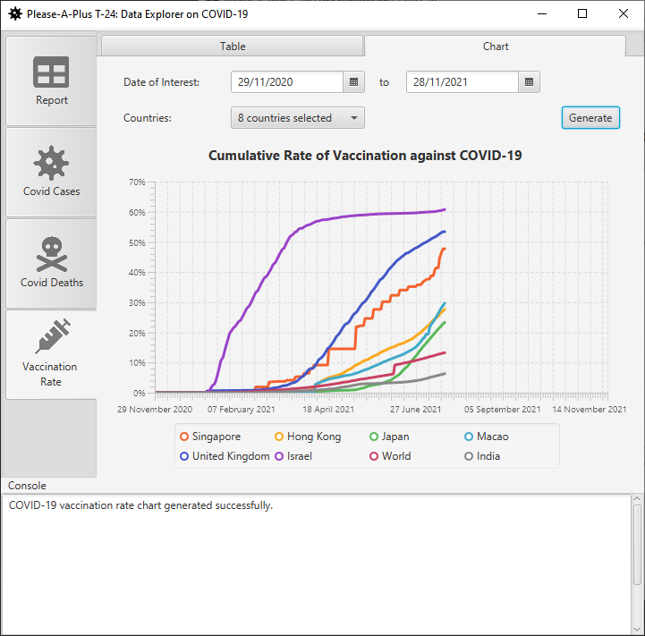

# COMP3111 T-24 - DeCovid

A simple JavaFX application which displays the worldwide COVID-19 statistics.

## Features

DeCovid features data analysis and visualization of the COVID-19 pandemic statistics, including the confirmed cases, deaths, and vaccination rate.

### Table Generation

To generate a table of the statistics, the user must first input the date of the interest. The user can then select the list of countries to be displayed in the table, or select the "Select All" option to display all countries. The table containing the COVID-19 cases/death/vaccination rate will then be generated based on the latest data available.

### Chart Generation

To generate a chart of the statistics, the user must first input the starting and ending date of interest. The user can then select the list of countries to be displayed in the table. The line chart of COVID-19 cases/death/vaccination rate statistics will be generated based on the latest data available.

## Unit testing

Please find the unit tests and the code coverage report in the [Unit Test Report](https://please-a-plus.github.io/COMP3111-T24-deCOVID/build/reports/tests/test/index.html) and [Jacoco Coverage Report](https://please-a-plus.github.io/COMP3111-T24-deCOVID/build/jacocoHTML/index.html) folders respectively.

## List of Contributors

1. [TANUWIJAYA Randy Stefan](https://github.com/rstanuwijaya) ([rstanuwijaya](mailto:rstanuwijaya@connect.ust.hk))
2. [Chan Kei Chi](https://github.com/gracekccc) ([gracekccc](mailto:kcchanbt@connect.ust.hk))
3. [GANI Bryan Suryaraso](https://github.com/airflow101) ([bsgani](mailto:bsgani@connect.ust.hk))

## Special Thanks

Special thanks to the HKUST COMP3111 Team (Prof. Kenneth Leung, Namkiu Chan, and Dimitrios Tsaras) for preparing and continuously supporting the project.
